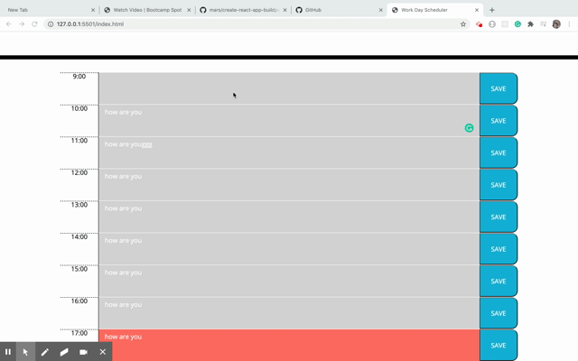

# calander

## An application that allows user user to create a calander that saves appointments  for 9 hours in a day 

## Table of Contents

* [Installation](#installation)
* [Usage](#usage)
* [Credits](#credits)
* [License](#license)

## Installation

## Usage 

The app is designed using jquery.The app is used to create a note and save the note in the calander :-
*

## Credits

Built with [materialize(https://materialize.com/).

NPM packages used: 
allow-prototype-access)

* [Node ]("")
* 

## License

Copyright © 2020 Yared Anbesie
